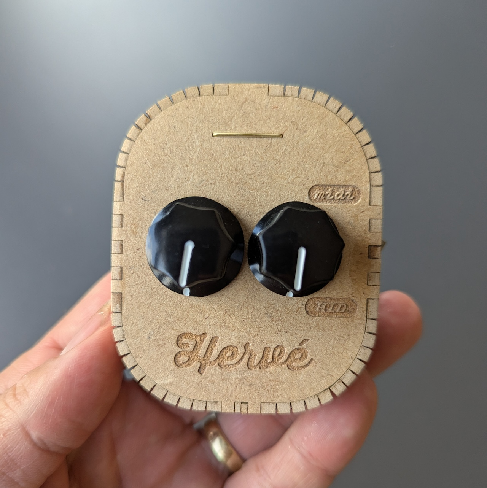
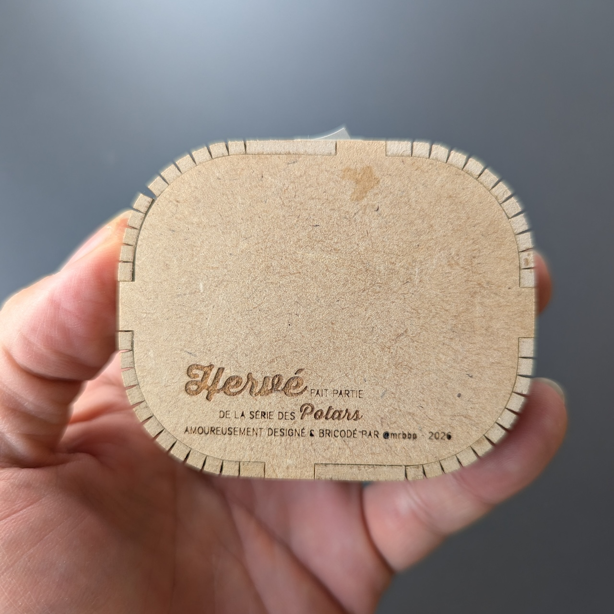

# Hervé BI ou Quad

Petit boîtier USB autour d’un **RP2040 Zero (Waveshare)** sous **CircuitPython 10.x** : il lit **2 à 4 potentiomètres 10 kΩ** et les expose à l’ordinateur soit en **MIDI** (messages de contrôle), soit en **HID gamepad** (axes de joysticks). Un **interrupteur** sur la carte choisit le mode **sans reconfigurer le firmware** : d’un côté tu as un contrôleur MIDI classique, de l’autre une manette reconnue par le système comme un gamepad.

Les sketchs **`code.py`** (boucle principale) et **`boot.py`** (USB + descripteur HID) vont à la racine du volume **CIRCUITPY**. Sans **`boot.py`** adapté, le MIDI peut marcher, mais le **gamepad HID** risque d’être absent ou incorrect.

---

## Ce que le firmware fait (fonctionnalités)

- **Deux modes USB** : **MIDI** (CC sur les mouvements de potars) ou **HID gamepad** (même potars pilotent des axes X/Y et, avec 4 potars, Z/Rz pour un second stick).
- **Bascule MIDI / HID** sur **GP5** : interrupteur **2 broches** vers **GND** uniquement ; le code active un **pull-up** interne — **contact fermé** = MIDI, **ouvert** = HID (pas de fil **3V3** sur l’interrupteur).
- **Numéros de CC MIDI** générés à partir de **`5°`** (défaut 31) : avec 2 pots, **32** puis **31**, puis **33, 34…** si tu ajoutes des voies (`_midi_cc_list`).
- **Lissage** sur plusieurs lectures par pot avant envoi, pour limiter le bruit et le spam MIDI.
- **MIDI entrant** : un **`NoteOff` canal courant, note 64** demande au boîtier de **renvoyer l’état actuel** de tous les pots en CC (pratique pour resynchroniser une appli).
- **LED NeoPixel** : flash court à chaque changement de valeur traité (couleur selon le pot).
- **Bouton / ligne boot** sur **GP4** : lu dans **`boot.py`** au démarrage (options USB commentées dans le fichier).

---

## Côté page web (navigateur)

Le boîtier est pensé pour être **simple à exploiter dans une page web** selon la position de l’interrupteur :

- **Mode MIDI** : utilise l’**[Web MIDI API](https://developer.mozilla.org/en-US/docs/Web/API/Web_MIDI_API)** (`navigator.requestMIDIAccess`). Tu reçois les **Control Change** sur les numéros décrits plus haut ; tu peux envoyer le **`NoteOff` note 64** pour forcer un rafraîchissement des valeurs.
- **Mode HID gamepad** : utilise l’**[Gamepad API](https://developer.mozilla.org/en-US/docs/Web/API/Gamepad_API)** (`navigator.getGamepads()` + événements `gamepadconnected`). Les axes apparaissent comme ceux d’une manette standard ; pas besoin de pilote spécifique côté navigateur.

HTTPS ou `localhost` selon les exigences du navigateur pour Web MIDI ; la Gamepad API fonctionne en général dès que le périphérique est vu comme gamepad.

---

## Branchements (résumé)

| Élément | Connexion |
|---------|-----------|
| **Boot** | **GP4** + **GND** |
| **Interrupteur MIDI / HID** | **GP5** + **GND** (2 broches, **pull-up** firmware) |
| **Potars** | Une entrée du tuple **`POT_GPIO`** = un pot ; broches ADC **GP26–GP29** selon ton montage |

Ne pas court-circuiter **GND** et **3V3**.

**Découpe laser Trotec (PDF boîtier) :** rouge = coupe, vert = coupe faible 30 %, noir = gravure.

---

## Où regarder dans le code

| Fichier / symbole | À quoi ça sert |
|-------------------|----------------|
| **`POT_GPIO`** | Liste des broches ADC = pot 0, 1, … ; **4** lignes → stick droit HID actif. |
| **`addr`**, **`_midi_cc_list`** | Base et liste des numéros de CC. |
| **`USB_MIDI_channel`** | Canal MIDI sortant (1–16). |
| **`mode_switch`**, **`use_midi`** | **GP5**, **`Pull.UP`**, logique `not mode_switch.value`. |
| **`_hid_axes_from_omesure`**, **`_gamepad_move_joysticks`** | Conversion pot → axes gamepad. |
| **`boot.py`** | Descripteur HID gamepad (report ID 4), **GP4** au boot. |

**Si le gamepad n’apparaît pas :** `boot.py` bien à la racine, build CircuitPython compatible avec la carte, redémarrage après copie des fichiers.

---

## English

### Hervé BI or Quad

Small **USB enclosure** built around a **Waveshare RP2040 Zero** running **CircuitPython 10.x**: it reads **2 to 4× 10 kΩ potentiometers** and exposes them to the host either as **MIDI** (control messages) or as an **HID gamepad** (joystick axes). A **switch** on the board picks the mode **without reflashing** the firmware: on one side you have a classic MIDI controller, on the other a pad the OS sees as a standard gamepad.

Place **`code.py`** (main loop) and **`boot.py`** (USB + HID descriptor) at the root of the **CIRCUITPY** drive. Without a matching **`boot.py`**, MIDI may work, but the **HID gamepad** may be missing or wrong.

### What the firmware does (features)

- **Two USB modes**: **MIDI** (CC when pots move) or **HID gamepad** (same pots drive X/Y axes, and with **four** pots also Z/Rz for a second stick).
- **MIDI / HID toggle** on **GP5**: **2-pin** switch to **GND** only; firmware enables an internal **pull-up** — **closed** = MIDI, **open** = HID (no **3V3** wire on the switch).
- **MIDI CC numbers** derived from **`addr`** (default 31): with two pots, **32** then **31**, then **33, 34…** if you add channels (`_midi_cc_list`).
- **Smoothing** over several samples per pot before sending, to cut noise and MIDI spam.
- **MIDI input**: a **`NoteOff` on the current channel, note 64** asks the device to **send the current state** of every pot as CCs (handy to resync an app).
- **NeoPixel LED**: short flash on each processed value change (colour depends on which pot changed).
- **Boot button / line** on **GP4**: read in **`boot.py`** at startup (USB options commented in that file).

### In the browser (web page)

The device is meant to be **easy to use from a web page**, depending on switch position:

- **MIDI mode**: use the **[Web MIDI API](https://developer.mozilla.org/en-US/docs/Web/API/Web_MIDI_API)** (`navigator.requestMIDIAccess`). You receive **Control Change** messages on the controller numbers described above; you can send **`NoteOff` note 64** to force a refresh of all values.
- **HID gamepad mode**: use the **[Gamepad API](https://developer.mozilla.org/en-US/docs/Web/API/Gamepad_API)** (`navigator.getGamepads()` and `gamepadconnected` events). Axes show up like a standard controller; no extra browser-side driver.

Browsers may require **HTTPS** or **`localhost`** for Web MIDI; the Gamepad API usually works as soon as the OS lists the device as a gamepad.

### Wiring (summary)

| Item | Connection |
|------|------------|
| **Boot** | **GP4** + **GND** |
| **MIDI / HID switch** | **GP5** + **GND** (2 pins, firmware **pull-up**) |
| **Pots** | One entry in the **`POT_GPIO`** tuple = one pot; ADC pins **GP26–GP29** per your layout |

Do not short **GND** and **3V3**.

**Trotec laser cut (enclosure PDF):** red = cut, green = light cut 30 %, black = engraving.

### Where to look in the code

| File / symbol | Purpose |
|---------------|---------|
| **`POT_GPIO`** | List of ADC pins = pot 0, 1, … ; **four** lines → right-stick HID active. |
| **`addr`**, **`_midi_cc_list`** | Base and list of CC numbers. |
| **`USB_MIDI_channel`** | MIDI output channel (1–16). |
| **`mode_switch`**, **`use_midi`** | **GP5**, **`Pull.UP`**, logic `not mode_switch.value`. |
| **`_hid_axes_from_omesure`**, **`_gamepad_move_joysticks`** | Pot readings → gamepad axes. |
| **`boot.py`** | HID gamepad descriptor (report ID 4), **GP4** at boot. |

**If the gamepad does not show up:** ensure **`boot.py`** is at the drive root, use a CircuitPython build compatible with the board, reboot after copying files.
